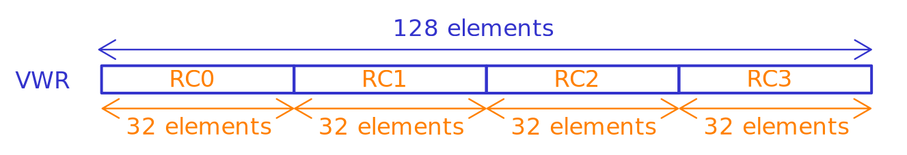

# Reconfigurable Cells

The Reconfigurable Cells (RCs) of the CGRA are the ones doing the bulk of the data processing. There are 4 RCs per column and each of them has two local registers. They can also access data from the VWRs but only from their slice of each VWR.

The VWRs are divided into as many regions as RCs in the column, so each RC can only access the elements that are in their part of the VWR at that time. The index of the element that is going to be accessed must be the same for every RC in the column but may vary for each VWR. This index is computed by the MXCU unit. As an example, every RC can access the 3rd element of their respective slice of the VWR_A in one cycle and the 17th element of their respective slice of the VWR_B in the following cycle. Also, the data inside the VWR can be shuffled (using the LSU) in order to be moved to a diferent slice so that another RC could access it in another cycle.

## Instruction format

The instructions for the LSU have a size of 18 bits with the following structure.

|MUXA_SEL|MUXB_SEL|OP_MODE|ALU_OP|MUXF_SEL|RF_WE|RF_WSEL|
|---|---|---|---|---|---|---|
|17:14|13:10|9|8:5|4:2|1|0|

- MUX{A/B}_SEL (4 bits) : Select inputs to the ALU.
    
    |Value|MUXA/MUXB|
    |---|---|
    |0|VWR_A|
    |1|VWR_B|
    |2|VWR_C|
    |3|SRF|
    |4|R0|
    |5|R1|
    |6|RCT|
    |7|RCB|
    |8|RCL|
    |9|RCR|
    |10|0|
    |11|1|
    |12|MAX_INT|
    |13|MIN_INT|
    |14|—|
    |15|—|
    
    The `SRF` option enables the access to the scalar registers that are shared by every RC in the column. To choose which register of the SRF to access (R0-R7) the MXCU unit is needed.
    
    The options `RCT`, `RCB`, `RCL` and `RCR` are meant to access the result of the previous cycle of one of the reconfigurable cell neighbours (top, bottom, left and right).
    
- OP_MODE (1 bit): Bit precision of the operands.
    
    |Value|Description|
    |---|---|
    |0|32-bit|
    |1|16-bit (not supported yet)|
    
- ALU_OP (4 bits): ALU operation to run.
    
    |Value|Operation|Description|
    |---|---|---|
    |0|NOP|No operation|
    |1|SADD|Signed addition|
    |2|SSUB|Signed substraction|
    |3|SMUL|Signed multiplication|
    |4|SDIV|Signed division|
    |5|SLL|Shift left logical|
    |6|SRL|Shift right logical|
    |7|SRA|Shift right arithmetic|
    |8|LAND|Logical AND|
    |10|LOR|Logical OR|
    |11|INB_SF_INA|Input of MUXA out if sign flag = 1 else input of MUXB out|
    |12|INB_ZF_INA|Input of MUXA out if zero flag = 1 else input of MUXB out|
    |13|FXP_MUL|Fixed point multiplication|
    |14|FXP_DIV|Fixed point division (reserved but not implemented)|
    |15|NOP|No operation|
    
    The `FXP_MUL` option uses 1 bit for the sign, half the datapath width for the integer part of the number and the rest of the datapath width for the decimal part of the number.
    
- MUXF_SEL (3 bits): Select a source for the “flag” parameter that is used to compute the zero and sign flags for the `INB_SF_INA` and `INB_ZF_INA ALU` operations.
    
    |Value|ALU flags from|
    |---|---|
    |0|OWN|
    |1|RCT|
    |2|RCB|
    |3|RCL|
    |4|RCR|
    
- RF_WE (1 bit): Enable writing ALU result to the chosen register.
- RF_WSEL (2 bits): One of the 2 local registers to write ALU result to.
> [!NOTE]
> Storing the output back to the register file is not mandatory because each RC is connected to the neighbored RCs through a register. So, every operation executed on the ALU writes to an ouput register where the neighbourgs can access the result value in the nex cycle. The data can also be written to the VWRs (controlled by the MXCU unit).