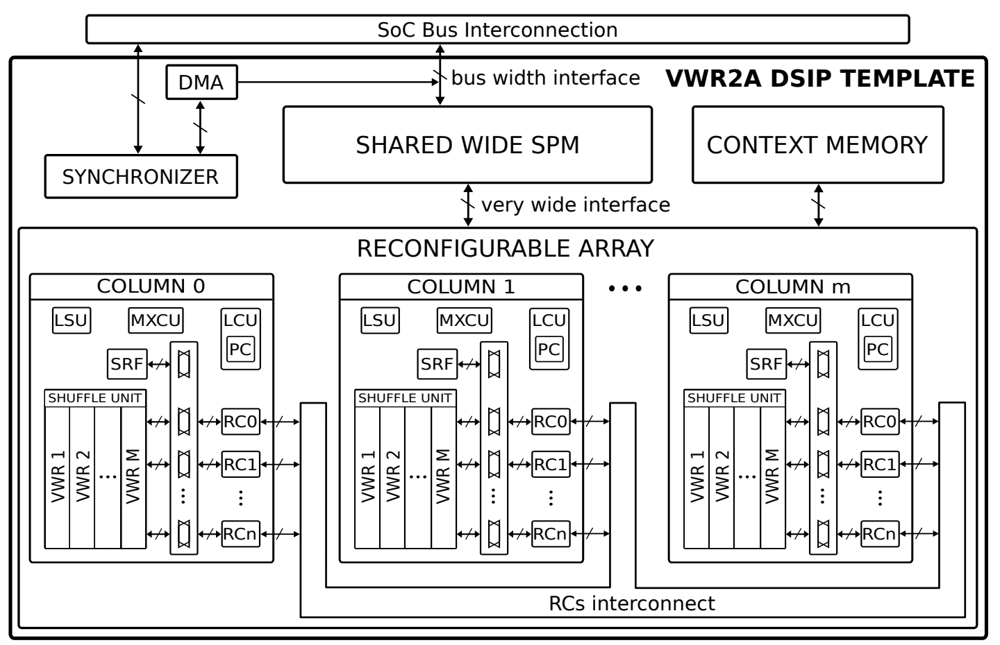

# VWR2A

# Overview

The Very-Wide-Register Reconfigurable-Array (VWR2A) architecture can be seen in the image. The reconfigurable array is made of multiple independent columns that can be reconfigured at runtime by a context switch from the context memory. The kernels are executed upon request from the host platform in which an instance of VWR2A is integrated. The synchronizer manages these requests and schedules their execution on the available columns. The DMA transfers data between the shared SPM of VWR2A and the platform’s main memory. Each column has multiple RCs to compute on data stored in VWRs and three specialized slots: a load-and-store unit (LSU), a loop-control unit (LCU), and a multiplexer-control unit (MXCU).

- The LSU is responsible for the data movement within a VWR (i.e., shuffling unit) and between the VWRs or the scalar register file (SRF) (of one column) and the shared Scratchpad Memory (SPM).
- The LCU manages the kernels’ execution by issuing, for example, branch or jump instructions and controls the program counter (PC) shared by all the units in a column (i.e., RCs and specialized slots).
- The MXCU generates the addresses to access the VWRs and the SRF from the RCs’ side.

In the HEEPalive platform we have an instance of the VWR2A with 2 columns that have 4 RCs each. Each of the RCs has three input/output VWRs (A, B and C) of 128 32-bit element width. Each of this specialized units and the RCs have a block of 512 memory address reserved in the context memory to store the instructions that they can later load to their own local configuration memory with 64 configuration words. The number of address reserved is independent of the number of columns, since this memory is shared by the columns. It also has an SPM with 64 entries of 128 32-bit element width.

# ISA

Each of the specialized slots, the RCs itselfs and the kernel memory has it’s own instructions with diferents formats. Checkout them:

[Kernel Memory](KMEM.md)

[Load-Store Unit](LSU.md)

[Reconfigurable Cells](RCs.md)

[Multiplexer Control Unit](MXCU.md)

[Loop Control Unit](LCU.md)

Also, an assembly ISA is provided.

[Assembly ISA](Attached/VWR2A_ISA.pdf)

# DMA

The DMA of the CGRA is controlled through the CGRA APB registers as follows.

| **Register** | **Description** |
| ---- | ---- |
| 0 | Core 0 kernel id request |
| 1 | Core 1 kernel id request |
| 2 | DMA address pointer |
| 3 | DMA transfer type:   - Write (1 bit): 1 to write from the SPM to the processor memory   - Read (1 bit): 1 to read from the processor memory to the SPM   - Push enable (1 bit): 1 to push the line read to the SPM in case it is not full   - Size (15 bits): Maximum size 8192 = 32 KB |
| 4 | Reserved |
| 5 | Reserved |
| 6 | Indicates interrupts from the DMA or the kernels |
| 7 | Cgra status:   - DMA pending request (2 bits)   - Core and kernel id currently running on the columns (0 means free) |

It does not have an ISA since the memory SPM reallocations have to be done manually on the C code with the following macros.

- Read request: `int32_t dsip_dma_read_req(const dsip_t *dsip, uint32_t data_ptr, uint32_t size, uint32_t line)`
    
    It reads `size` elements of 32 bits from the `line` entry of the SPM and stores them on the buffer `data_ptr`. It allways returns 0.
    
- Write request: `int32_t dsip_dma_write_req(const dsip_t *dsip, uint32_t data_ptr, uint32_t size, uint32_t line, uint32_t push)`
    
    It writes `size` elements of 32 bits from `data_ptr` to the `line` entry of the SPM and pushes the content is the `push` is enabled. It allways returns 0.
    
- Wait: `void dsip_dma_wait(const dsip_t *dsip, uint16_t ntransfer)`
    
    It waits for the DMA to finish the specified number of transfers on `ntransfer`.